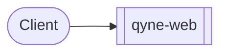
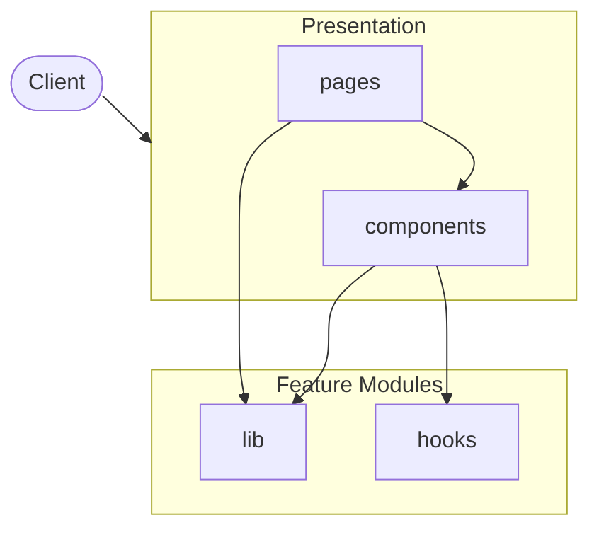

# qyne-web

*Auto-generated by [zinsight](https://github.com/zinboard/zinsight) on 2026-06-04*

## What This App Does

**Qyne Web** is a **frontend application** built with **React, React DOM**.

### Core Capabilities

- **How It Works**
- **For Academies**
- **For Athletes**
- **About**
- **Not Found**

In total, the system exposes **6** modules.


## Overview

| **42** files · **2,369** lines of code · **6** modules |
|---|

**Project docs:** [React + TypeScript + Vite](README.md)

## At a Glance

A 60-second mental snapshot — what calls in, what we call out, where state lives.



## Frontend at a Glance

**Framework:** React (Vite) · **Router:** `react-router` · **Components:** 29 · **Pages:** 6 · **Styling:** Tailwind CSS

### Routes

| Path | Component | File |
|------|-----------|------|
| `how-it-works` | `HowItWorks` | `src/App.tsx` |
| `for-academies` | `ForAcademies` | `src/App.tsx` |
| `for-athletes` | `ForAthletes` | `src/App.tsx` |
| `about` | `About` | `src/App.tsx` |
| `*` | `NotFound` | `src/App.tsx` |

## Lifecycle

Things that happen when the app boots, when requests arrive, and when external systems trigger us.

**On boot**

- Application bootstrap (trigger: `Process start`) — `src/main.tsx`

## What This Repo Isn't

Stops you looking for things that don't exist here.

- **No background job queue** — _No bull/bullmq/kafkajs/amqplib/SQS client imports detected._
- **No file uploads** — _No multer/busboy/formidable/FileInterceptor usage detected._
- **No payment processing** — _No payment-provider SDK or service detected._

## Table of Contents

- [What This App Does](#what-this-app-does)
- [Overview](#overview)
- [At a Glance](#at-a-glance)
- [Frontend at a Glance](#frontend-at-a-glance)
- [Lifecycle](#lifecycle)
- [What This Repo Isn't](#what-this-repo-isnt)
- [Tech Stack](#tech-stack)
- [Architecture](#architecture)
- [Modules](#modules)
- [Getting Started](#getting-started)
- [Hotspots](#hotspots)
- [New Developer Guide](#new-developer-guide)

## Tech Stack

| Category | Technologies |
|----------|-------------|
| **Runtime** | Node.js |
| **Languages** | TypeScript, JavaScript |
| **Frameworks** | React, React DOM |
| **Build & Dev Tools** | ESLint, TypeScript, Vite |

## Architecture



## Modules

| Module | Purpose | Files | Lines |
|--------|---------|-------|-------|
| **components** | UI components. | 29 | 2,071 |
| **pages** | Top-level page/route views. | 6 | 109 |
| **lib** | Feature module — 2 files, 2 public exports. | 2 | 90 |
| **hooks** | Custom React hooks. | 1 | 23 |

## Getting Started

### Prerequisites

- **Node.js** (check `.nvmrc` or `engines` in package.json for version)
- **npm** as package manager

### Installation

```bash
# Clone the repository
git clone <repository-url>
cd <project-directory>

# Install dependencies
npm install
```

### Running Locally

```bash
# Start development server with hot reload
npm run dev

# Build for production
npm run build

# Run linter
npm run lint

```

## Hotspots

Files most-changed in the last 180 days. Hotspots = where bugs live and where docs matter most.

| Rank | File | Changes | Authors | Last touched |
|------|------|---------|---------|--------------|
| 1 | `eslint.config.js` | 1 | 1 | 2026-05-20 |
| 2 | `src/App.tsx` | 1 | 1 | 2026-05-20 |
| 3 | `src/components/animations/AnimatedCounter.tsx` | 1 | 1 | 2026-05-20 |
| 4 | `src/components/animations/PulseRing.tsx` | 1 | 1 | 2026-05-20 |
| 5 | `src/components/animations/ScrollReveal.tsx` | 1 | 1 | 2026-05-20 |
| 6 | `src/components/layout/Footer.tsx` | 1 | 1 | 2026-05-20 |
| 7 | `src/components/layout/Nav.tsx` | 1 | 1 | 2026-05-20 |
| 8 | `src/components/layout/PageStub.tsx` | 1 | 1 | 2026-05-20 |
| 9 | `src/components/layout/RootLayout.tsx` | 1 | 1 | 2026-05-20 |
| 10 | `src/components/layout/ScrollManager.tsx` | 1 | 1 | 2026-05-20 |
| 11 | `src/components/primitives/Button.tsx` | 1 | 1 | 2026-05-20 |
| 12 | `src/components/primitives/Container.tsx` | 1 | 1 | 2026-05-20 |
| 13 | `src/components/primitives/Eyebrow.tsx` | 1 | 1 | 2026-05-20 |
| 14 | `src/components/primitives/Logo.tsx` | 1 | 1 | 2026-05-20 |
| 15 | `src/components/primitives/Seo.tsx` | 1 | 1 | 2026-05-20 |
| _… 15 more files with changes_ | | | | |

## New Developer Guide

> Everything you need to get oriented in this codebase as a new team member.

### Project Structure

```
src/
├── components/             # Components module (29 files, 2,071 loc)
├── pages/                  # Pages module (6 files, 109 loc)
├── lib/                    # Lib module (2 files, 90 loc)
└── hooks/                  # Hooks module (1 files, 23 loc)
```

### Key Files

| # | File | Category | Lines | Why read this |
|---|------|----------|-------|---------------|
| 1 | `src/main.tsx` | Entry Point | 20 | Application bootstrap — initializes 1 dependencies, sets up middleware, and starts the server. Start here to understand how the app is wired together |
| 2 | `eslint.config.js` | Configuration | 23 | Configuration for eslint.config — exports: default |
| 3 | `src/components/animations/ScrollReveal.tsx` | Business Logic | 65 | Core module imported by 13 files — exports: EASE, ScrollReveal, Stagger. |
| 4 | `src/components/primitives/Container.tsx` | Business Logic | 36 | Core module imported by 10 files — exports: Container, Section. |
| 5 | `src/lib/site.ts` | Business Logic | 82 | Core module imported by 6 files — exports: SITE, NAV_LINKS, WEARABLES, TRUST_ACADEMIES (+2 more). |
| 6 | `src/lib/utils.ts` | Shared Utility | 8 | Shared helpers used by 15 files across the codebase — provides: cn |

### Common Tasks

| If you want to... | Start here | Pattern to follow |
|-------------------|-----------|-------------------|
| Understand the startup flow | `src/main.tsx` | Follow imports from main → app module → feature modules |

---

*Generated by [zinsight](https://github.com/zinboard/zinsight)*
